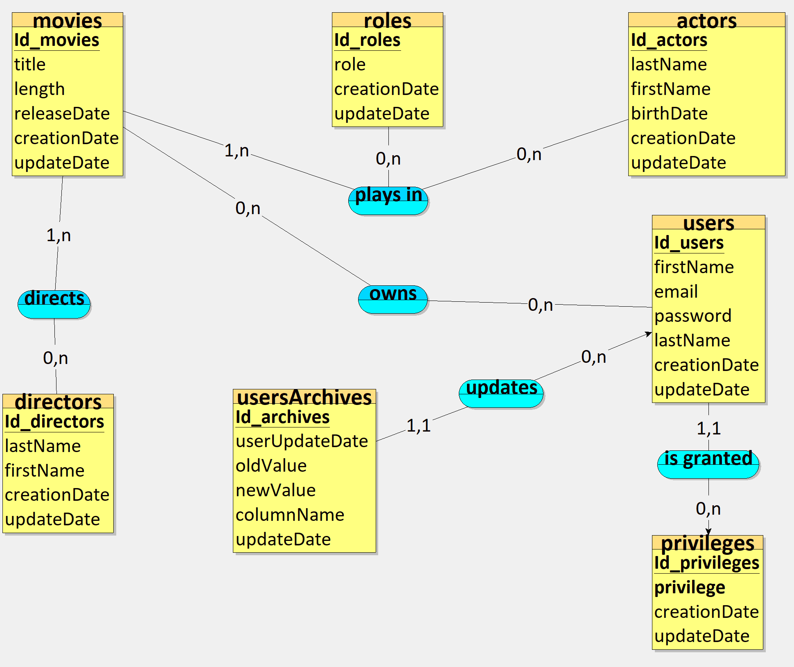

# Streaming database

Database ran in docker container referencing users, movies, directors and actors

## Description

This project contains three pdf file corresponding to the CDM, LDM and PDM of the database in the ./assets/pdf/ file :

CDM :

CDM :

CDM :


## Getting Started

This section provides instructions on setting up and running the project. By the end, you'll have a running SQL Server instance with (or without) mock data.

### Prerequisites
* Docker installed on your machine.
* Basic knowledge of SQL Server and Docker (optional but recommended).

### Setup and Running

Clone the Repository :
```bash
git clone https://github.com/2023-cda-alt-devops-p4/streaming-PF.git
cd streaming-PF
```

Create a safe password :
```bash
export MSSQL_SA_PASSWORD=YourStrongPasswordHere
```

Build the Docker Image :
```bash
docker build -t mssql-server-image --build-arg SA_PASSWORD_ARG=$MSSQL_SA_PASSWORD .
```

Run the SQL Server Container ('mssql-server-container' is just a suggestion, change it at ease) :
```bash
docker run --name mssql-server-container -e 'ACCEPT_EULA=Y' -p 1433:1433 -d mssql-server-image
```

Populating the Database with Mock Data (Optional):
```bash
cat data.sql | docker exec -i mssql-server-container /opt/mssql-tools/bin/sqlcmd -U SA -P $MSSQL_SA_PASSWORD
```

### Accessing the Database
You can access the SQL Server instance using your preferred SQL client. Use the following connection details:

Host: localhost<br>
Port: 1433<br>
Username: SA<br>
Password: YourStrongPasswordHere

### Stopping and Removing the Container

When done, you can stop the SQL Server container with :
```bash
docker stop mssql-server-container
```

To remove the container :
```bash
docker rm mssql-server-container
```

## Querries set for testing purpose


## Authors

Contributors names

* Pierre Fraisse

## Version History

* 0.1
    * Initial Release

## License

This project is licensed under the [MIT] License - see the LICENSE.md file for details