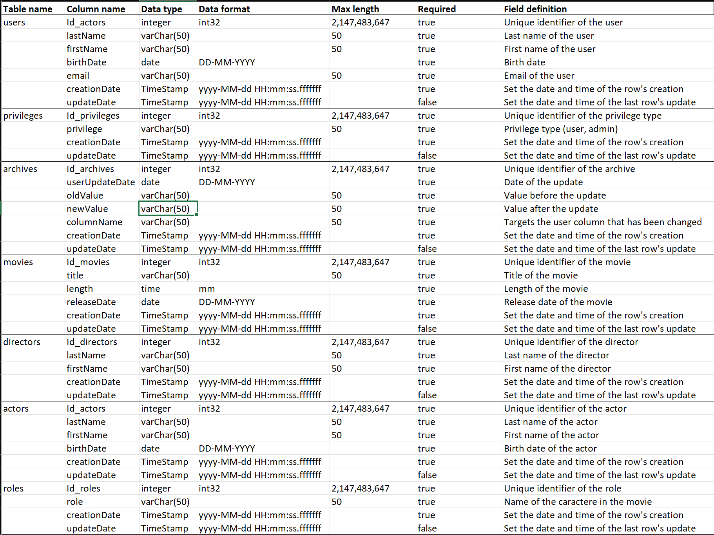

# Streaming database

Database ran in docker container referencing users, movies, directors and actors

## Description

This project contains three pdf file corresponding to the CDM, LDM and PDM of the database in the ./assets/pdf/ folder and a streaming_data_dictionary.xlsx in the assets folder :

Data Dictionary :

CDM :

LDM :

CDM :


## Getting Started

This section provides instructions on setting up and running the project. By the end, you'll have a running SQL Server instance with (or without) mock data.

### Prerequisites
* Docker and Docker Compose installed on your machine.
* A SQL Server Client (SSMS, SSDT, Azure Data Studio, DataGrip...)
* Basic knowledge of SQL Server and Docker (optional but recommended).

### Setup and Running

Clone the Repository :
```bash
git clone https://github.com/2023-cda-alt-devops-p4/streaming-PF.git
cd streaming-PF
```

Pull the image, start the MSSQL container and create full database :
```bash
docker compose up
```
Purpose of Dockerfile : starts the automation script

Purpose of init-sql-server.sh : runs the sql scripts automaticaly

Purpose of sql files in assets/sql :

* Creating the Database tables : init.sql

* Populating the Database with Mock Data (Optional): data.sql

* Creating admin and user role : privileges.sql (admin login : admin, password : Adm1n*** / user login : user, password : Us3r***!)

* Running the trigger to populate the users archives : users_table_update_archive_trigger.sql

* Creating the stored procedure to get movies list by director : sp_GetMoviesByDirector.sql. The command to execute it :
```bash
EXEC sp_GetMoviesByDirector @DirectorFirstName='Christopher', @DirectorLastName='Nolan';
```

* Test querries file : test-querries.sql


### Accessing the Database
You can access the SQL Server instance using your preferred SQL client. Use the following connection details:

Host: localhost<br>
Port: 1433<br>
Username: yourUsername
Password: yourPassword

### Stopping and Removing the Container

When done, you can stop and remove the SQL Server container with :
```bash
docker compose down
```

## Querries set for testing purpose

Querries stocked in my test-querries.sql file :

* Select titles and release dates from the most recent to older movie :
```sql
SELECT title, releaseDate
FROM movies
ORDER BY releaseDate DESC;
```

* Last and first names, of actors that are older than 30, in alphabetical order :
```sql
SELECT
    firstname,
    lastname,
    YEAR(GETDATE()) - YEAR(birthDate) -
        CASE
            WHEN MONTH(GETDATE()) * 100 + DAY(GETDATE()) < MONTH(birthDate) * 100 + DAY(birthDate) THEN 1
            ELSE 0
        END AS age
FROM
    Actors
WHERE
    birthDate <= DATEADD(YEAR, -30, GETDATE())
ORDER BY
    lastName,
    firstName;
```

* Display the main actor for a given movie :
```sql
SELECT
    a.firstName,
    a.lastName
FROM
    actors AS a
JOIN
    plays_in AS pi ON a.Id_actors = pi.Id_actors
JOIN
    movies AS m ON pi.Id_movies = m.Id_movies
JOIN
    roles AS r ON pi.Id_roles = r.Id_roles
WHERE
    m.title = 'Inception'
AND
    r.role = 'Main';
```

* Give a list of films for a given actor :
```sql
SELECT
    m.title
FROM
    movies AS m
JOIN
    plays_in AS pi ON m.Id_movies = pi.Id_movies
JOIN
    actors AS a ON pi.Id_actors = a.Id_actors
WHERE
    a.lastName = 'DiCaprio';
```

* Add a movie :
```sql
INSERT INTO movies (title, length, releaseDate)
VALUES ('The Godfather', '02:55:00.0000000', '1972-10-18');
```

* Add an actor :
```sql
INSERT INTO actors (lastName, firstName, birthDate)
VALUES ('Brando', 'Marlon', '1924-04-03');
```

* Update a movie by name :
```sql
UPDATE movies
SET length = '', releaseDate = ''
WHERE title = '';
```

* Delete an actor :
```sql
DELETE actors
WHERE lastName = 'Brando';
```

* Select the 3 last added actors :
```sql
SELECT TOP 3 *
FROM actors
ORDER BY Id_actors DESC;
```
Stocked procedure to get movies when entring director's name :
* Procedure :
```sql
CREATE PROCEDURE sp_GetMoviesByDirector
@DirectorFirstName NVARCHAR(50),
@DirectorLastName NVARCHAR(50)
AS
BEGIN
    SELECT m.title
    FROM movies m
    JOIN directs d ON m.Id_movies = d.Id_movies
    JOIN directors dir ON d.Id_directors = dir.Id_directors
    WHERE dir.firstName = @DirectorFirstName AND dir.lastName = @DirectorLastName;
END;
```
* Execution command :
```sql
EXEC sp_GetMoviesByDirector @DirectorFirstName='Christopher', @DirectorLastName='Nolan';
```

## Authors

Contributors names

* Pierre Fraisse

## Version History

* 0.1
    * Initial Release

## License

This project is licensed under the MIT License - see the [LICENSE] (LICENSE) file for details