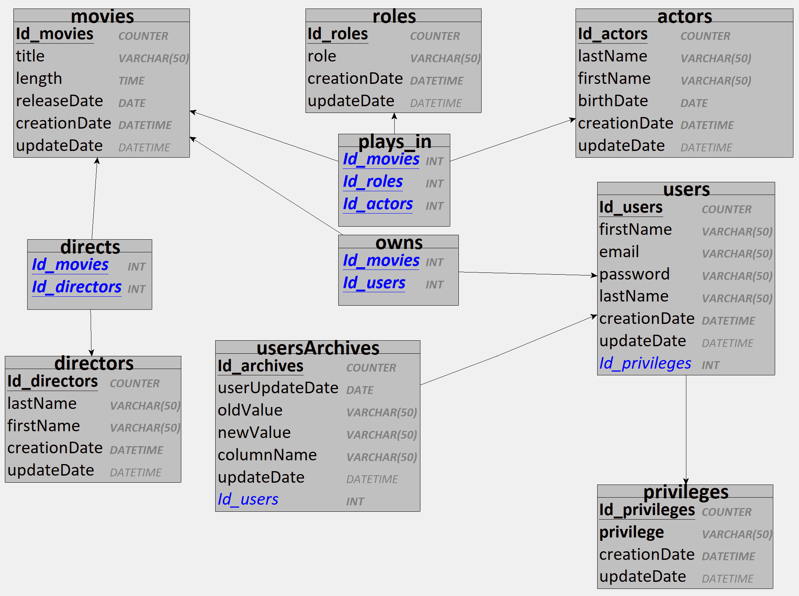

# Streaming database

Database ran in docker container referencing users, movies, directors and actors

## Description

This project contains three pdf file corresponding to the CDM, LDM and PDM of the database in the ./assets/pdf/ file :

CDM :

CDM :

CDM :


## Getting Started

This section provides instructions on setting up and running the project. By the end, you'll have a running SQL Server instance with (or without) mock data.

### Prerequisites
* Docker installed on your machine.
* Basic knowledge of SQL Server and Docker (optional but recommended).

### Setup and Running

Clone the Repository :
```bash
git clone https://github.com/2023-cda-alt-devops-p4/streaming-PF.git
cd streaming-PF
```

Create a safe password :
```bash
export MSSQL_SA_PASSWORD=YourStrongPasswordHere
```

Build the Docker Image :
```bash
docker build -t mssql-server-image --build-arg SA_PASSWORD_ARG=$MSSQL_SA_PASSWORD .
```

Run the SQL Server Container ('mssql-server-container' is just a suggestion, change it at ease) :
```bash
docker run --name mssql-server-container -e 'ACCEPT_EULA=Y' -p 1433:1433 -d mssql-server-image
```

Populating the Database with Mock Data (Optional):
```bash
cat data.sql | docker exec -i mssql-server-container /opt/mssql-tools/bin/sqlcmd -U SA -P $MSSQL_SA_PASSWORD
```

### Accessing the Database
You can access the SQL Server instance using your preferred SQL client. Use the following connection details:

Host: localhost<br>
Port: 1433<br>
Username: SA<br>
Password: YourStrongPasswordHere

### Stopping and Removing the Container

When done, you can stop the SQL Server container with :
```bash
docker stop mssql-server-container
```

To remove the container :
```bash
docker rm mssql-server-container
```

## Querries set for testing purpose

Querries stocked in my test-querries.sql file :

* Selects titles and release dates :
```sql
from the most recent to older movie
SELECT title, releaseDate
FROM movies
ORDER BY releaseDate DESC;
```

* Last and first names, of actors :
```sql
that are older than 30, in alphabetical order
SELECT
    firstname,
    lastname,
    YEAR(GETDATE()) - YEAR(birthDate) -
        CASE
            WHEN MONTH(GETDATE()) * 100 + DAY(GETDATE()) < MONTH(birthDate) * 100 + DAY(birthDate) THEN 1
            ELSE 0
        END AS age
FROM
    Actors
WHERE
    birthDate <= DATEADD(YEAR, -30, GETDATE())
ORDER BY
    lastName,
    firstName;
```

* Displays the main actor for a given movie :
```sql
SELECT
    a.firstName,
    a.lastName
FROM
    actors AS a
JOIN
    plays_in AS pi ON a.Id_actors = pi.Id_actors
JOIN
    movies AS m ON pi.Id_movies = m.Id_movies
JOIN
    roles AS r ON pi.Id_roles = r.Id_roles
WHERE
    m.title = 'Inception'
AND
    r.role = 'Main';
```

* Gives a list of films for a given actor :
```sql
SELECT
    m.title
FROM
    movies AS m
JOIN
    plays_in AS pi ON m.Id_movies = pi.Id_movies
JOIN
    actors AS a ON pi.Id_actors = a.Id_actors
WHERE
    a.lastName = 'DiCaprio';
```

* Adds a movie :
```sql
INSERT INTO movies (title, length, releaseDate)
VALUES ('The Godfather', '02:55:00.0000000', '1972-10-18');
```

* Adds an actor :
```sql
INSERT INTO actors (lastName, firstName, birthDate)
VALUES ('Brando', 'Marlon', '1924-04-03');
```

* Updates a movie by name :
```sql
UPDATE movies
SET length = '', releaseDate = ''
WHERE title = '';
```

* Deletes an actor :
```sql
DELETE actors
WHERE lastName = 'Brando';
```

* Selects the 3 last added actors :
```sql
SELECT TOP 3 *
FROM actors
ORDER BY Id_actors DESC;
```

## Authors

Contributors names

* Pierre Fraisse

## Version History

* 0.1
    * Initial Release

## License

This project is licensed under the [MIT] License - see the LICENSE.md file for details